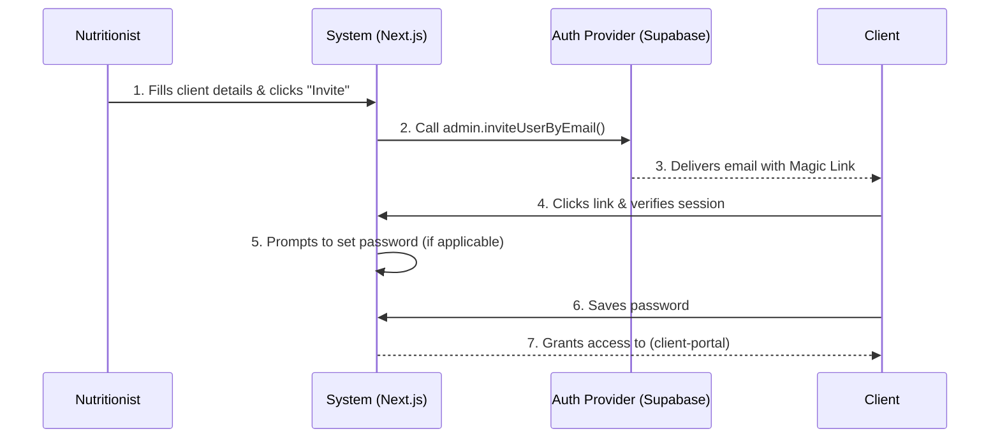

## ADDED Requirements

### Requirement: Client Profile Creation by Nutritionist
The system SHALL allow a Nutritionist to create a Client profile from their dashboard.

#### Scenario: Successful profile creation
- **WHEN** Nutritionist submits the required client details
- **THEN** system creates the client record associated with the Nutritionist

### Requirement: Client Invitation
The system SHALL support sending an initial access invitation (which may include a temporary password or magic link) to the newly created Client.

#### Scenario: Invitation sent
- **WHEN** Nutritionist triggers the invitation for a client
- **THEN** system sends the access credentials/link to the client's email address

### Diagram: Invitation Flow

