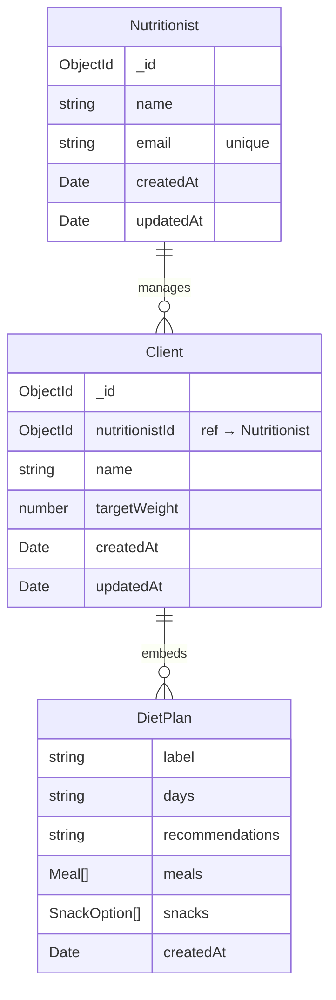

## Why

The current app structure treats the diet creator (`/`) as the primary entrypoint, while client management lives at `/clients`. This is backwards — the nutricionista's workflow is client-centric: select a client → view/create plans. Additionally, the `DietPlan` schema still carries redundant `clientId` and `clientName` fields from a pre-embedding design, and there's no concept of the nutricionista who manages each client.

## What Changes

- **Route restructure**: Root (`/`) becomes the clients list; diet creator moves to a secondary route
- **Client detail enhancement**: Add "Ver Plan" action on `/clients/[id]` that navigates to the plan viewer
- **DietPlan schema cleanup**: Remove redundant `clientId` and `clientName` from both Zod schema and Mongoose sub-schema — these are implicit from the parent `Client` document
- **Nutricionista data model**: Introduce a `Nutritionist` entity and associate clients to their nutricionista

## Data Modeling Analysis

### Embedded DietPlan — Keep or separate?

The current design embeds `plans[]` inside each `Client` document. This is **the right approach** for this domain because:

1. Plans are always accessed in the context of a specific client (never queried independently)
2. Plans are historical snapshots — once saved, they're immutable
3. Reading a client's full history is a single document read (no joins)
4. MongoDB's 16MB document limit is unlikely to be hit (a plan with 5 meals × 4 blocks × 5 foods ≈ 2-3KB; a client would need ~5,000 plans to approach the limit)

**Recommendation**: Keep embedded plans. ✅

### Nutricionista modeling — Reference pattern

For the nutricionista, a **separate collection with reference** is the best fit:

**Why a separate collection?**
- A nutricionista is a **distinct entity** with its own lifecycle (future: auth, profile, settings)
- "All clients for nutricionista X" becomes a simple indexed query: `Client.find({ nutritionistId })`
- Updating nutricionista info (name, email) happens in one place — no fan-out across clients
- Future multi-nutricionista scenario is supported naturally

**Why NOT embed nutricionista in Client?**
- Redundant data (name/email duplicated across every client)
- Updating nutricionista info requires updating all client documents

## Capabilities

### New Capabilities
- `nutritionist-management`: Nutricionista data model, Mongoose schema, and CRUD Server Actions. Separate `nutritionists` collection with `name` and `email` fields.

### Modified Capabilities
- `client-management`: Add `nutritionistId` reference field to Client model. Filter clients by nutricionista.
- `client-management-ui`: **BREAKING** — Route restructure. Root (`/`) renders clients list instead of creator. Client detail page adds "Ver Plan" navigation to viewer.
- `diet-plan-persistence`: Remove redundant `clientId` and `clientName` from DietPlan embedded schema and Zod types.

## Impact

- **Routes**: `app/page.tsx` changes from Creator → Clients list. Creator moves to separate route (e.g., `/creator`).
- **Schemas**: `DietPlan.ts` (Zod) and `Client.ts` (Mongoose) lose `clientId`/`clientName` fields.
- **New model**: `Nutritionist.ts` Mongoose model + `nutritionistActions.ts` Server Actions.
- **Client model**: `Client.ts` gains `nutritionistId` field (ObjectId ref).
- **Menu component**: Navigation links updated for new route structure.
- **No external dependency changes** — still uses Mongoose + MongoDB Atlas.
